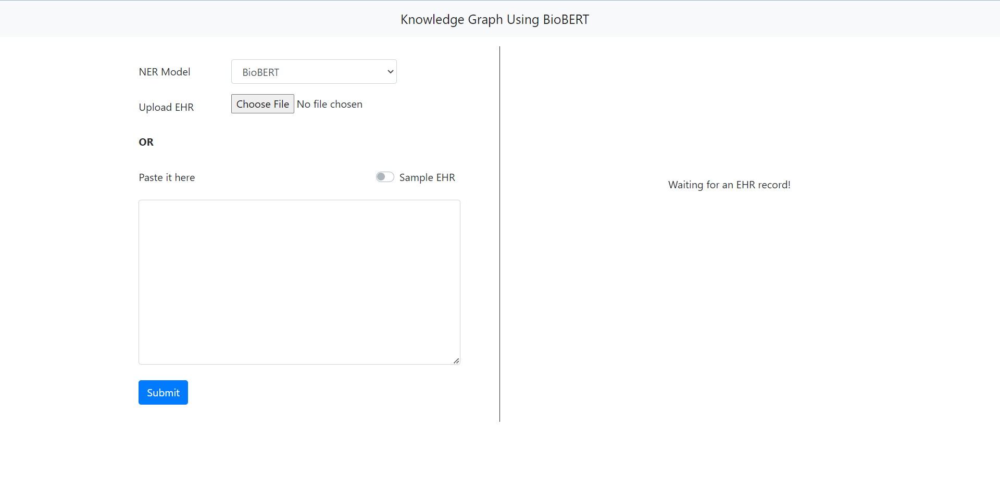
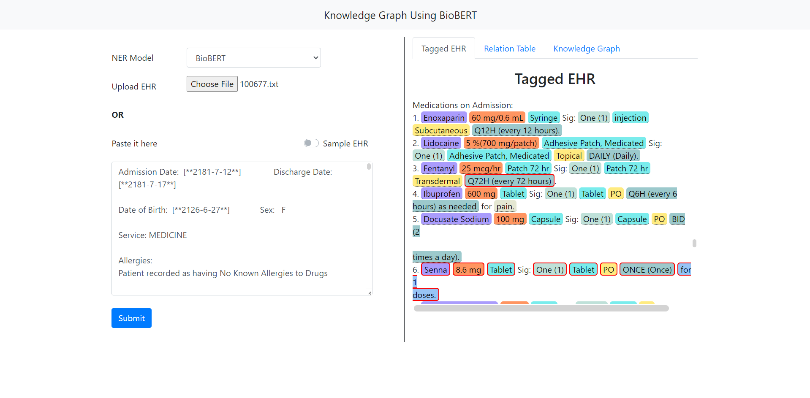
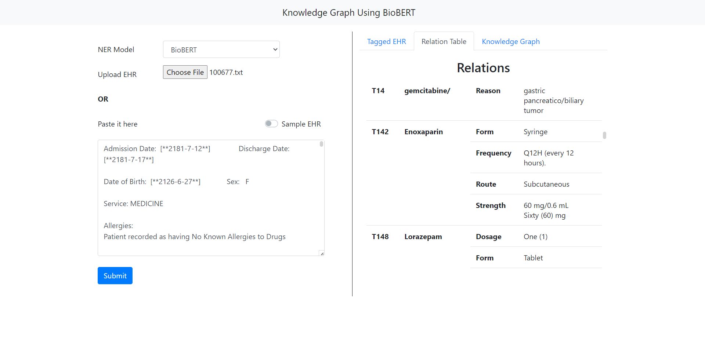
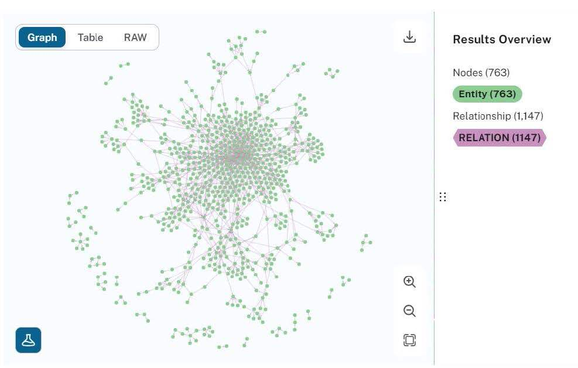
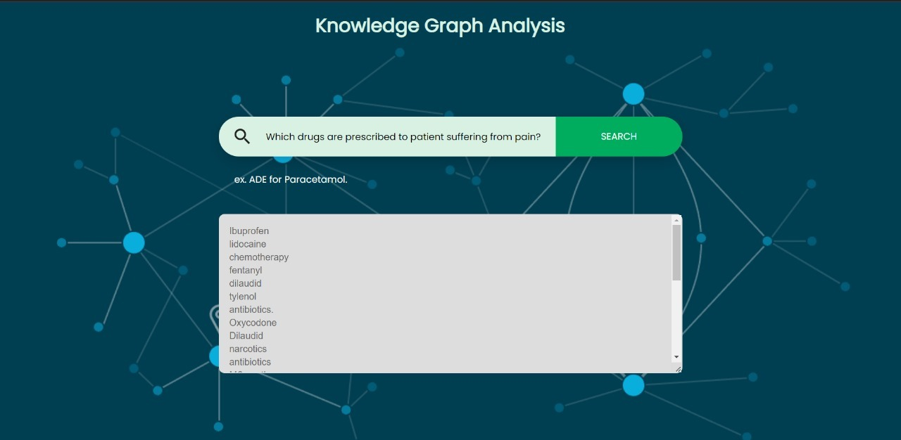

<br/>
<p align="center">
  <h1 align="center">🧠 Knowledge Graph Using BioBERT</h1>
</p>

## 📖 Table Of Contents

* [About the Project](#about-the-project)
* [Built With](#built-with)
* [Getting Started](#getting-started)
  * [Prerequisites](#prerequisites)
  * [Installation](#installation)
* [Usage](#usage)
* [Contributing](#contributing)
* [License](#license)
* [Authors](#authors)
* [Acknowledgements](#acknowledgements)

## ℹ️ About The Project

 <p align="center">
    
  </p>

This repository includes code for Named Entity Recognition and Relationship Extraction methods and knowledge graph generation through EHR records. These methods were performed on the n2c2 2018 challenge dataset which was augmented to include a sample of the ADE corpus dataset.

The purpose of this project is to automatically structure this data into a format that would enable doctors and patients to quickly find the information they need. Specifically, this involves building a Named Entity Recognition (NER) model that recognizes entities such as **drug**, **strength**, **duration**, **frequency**, **adverse drug event (ADE)**, **reason**, **route**, and **form**.

Furthermore, the model recognizes the relationship between drugs and every other named entity, generating a knowledge graph to make it easier for doctors to analyze a patient’s disease and drug history at a quick glance. The model also features a query-answering capability where the knowledge graph is used to answer user queries.

The main objective is to use the extracted relationships to build a comprehensive knowledge graph for providing quick summaries, query answering, and analysis, thus simplifying knowledge discovery in the biomedical field.

## 📝 Publication

This project has been published as a research paper in the IEEE Xplore digital library. The paper details the methodology and findings of using BioBERT for knowledge graph generation from biomedical texts.

**You can view the full paper here:** **[Knowledge Graph Generation from Biomedical Literature using BioBERT](https://ieeexplore.ieee.org/document/10481625)**

### Abstract
> The research delves into the process of extracting relationships from biomedical literature and building a knowledge graph using those relationships. Information retrieval, knowledge discovery, and data analysis are just a few of the uses for named entity extraction in biomedical research, which includes important entities such as Adverse Drug Effects (ADE), doses, drug names, and more. Using BERT's word contextual comprehension, the report investigates the use of the BioBERT model for named entity recognition and relationship extraction. When calibrated on Electronic Health Records (EHR) data, BioBERT— a biological text-specific model—helps with clinical decision-making and research by recognizing links between elements such as diseases, symptoms, and therapies. The use of Neo4j for knowledge graph generation, which permits a thorough representation of biomedical concepts and their relationships, is also highlighted in the paper. Information retrieval and analysis are made easier by this organized knowledge. This strategy has the potential to revolutionize biomedical research and healthcare by providing fresh perspectives and better results, despite ongoing challenges. More developments in this field are anticipated as a result of ongoing research and development.

## 🛠️ Built With

* [Python](https://www.python.org/) – Core backend language  
* [JavaScript](https://developer.mozilla.org/en-US/docs/Web/JavaScript) – Web interface logic  
* [HTML/CSS](https://developer.mozilla.org/en-US/docs/Web/HTML) – Web frontend layout  
* [FastAPI](https://fastapi.tiangolo.com/) – Lightweight backend framework  
* [Neo4j](https://neo4j.com/) – Graph database for storing extracted knowledge  
* **Natural Language Processing (NLP)** – Used to extract entities and relationships from biomedical text  
* [BioBERT](https://github.com/dmis-lab/biobert) – Pretrained biomedical BERT model used for NER/RE  

## 🚀 Getting Started

To run this project locally, you need to get the datasets from the links mentioned below, preprocess them, and have a Neo4j account for knowledge graph generation.

### 📌 Prerequisites

1.  **Datasets used for training:**
    *   `https://huggingface.co/datasets/ade_corpus_v2`
    *   `https://portal.dbmi.hms.harvard.edu/projects/n2c2-nlp/`

2.  **Neo4j Connection URI:**
    *   Create an account and get your credentials from `https://neo4j.com/`

3.  **Python Modules:**
    Install all required packages from `requirements.txt`.
    ```sh
    pip install -r requirements.txt
    ```

### 📥 Installation

1.  **Preprocess the datasets**

    Run the script to generate data for NER or RE tasks.
    ```sh
    python generate_data.py \
        --task ner \
        --input_dir data \
        --ade_dir ade_corpus \
        --target_dir dataset \
        --max_seq_len 512 \
        --dev_split 0.1 \
        --tokenizer biobert-base \
        --ext txt \
        --sep " "
    ```
    *   `--task`: Can be `ner` or `re` for Named Entity Recognition and Relation Extraction tasks, respectively.
    *   `--input_dir`: Should have `train` and `test` subfolders, each containing `.txt` and `.ann` files.
    *   `--ade_dir`: (Optional) Should contain `.json` files from the ADE Corpus dataset.
    *   `--max_seq_len`: Should not exceed 512 for the BioBERT model.
    *   `--tokenizer`: Use `biobert-base` for the BioBERT model.
    *   `--ext` and `--sep`: Use `txt` and `" "` for NER; use `tsv` and `tab` for RE.

2.  **Train the NER and RE Models**

    *   **NER Model Training**
        ```sh
        export SAVE_DIR=./output
        export DATA_DIR=./dataset
        export MAX_LENGTH=128
        export BATCH_SIZE=16
        export NUM_EPOCHS=5
        export SAVE_STEPS=1000
        export SEED=0

        python run_ner.py \
            --data_dir ${DATA_DIR} \
            --labels ${DATA_DIR}/labels.txt \
            --model_name_or_path dmis-lab/biobert-large-cased-v1.1 \
            --output_dir ${SAVE_DIR} \
            --max_seq_length ${MAX_LENGTH} \
            --num_train_epochs ${NUM_EPOCHS} \
            --per_device_train_batch_size ${BATCH_SIZE} \
            --save_steps ${SAVE_STEPS} \
            --seed ${SEED} \
            --do_train \
            --do_eval \
            --do_predict \
            --overwrite_output_dir
        ```
    *   **RE Model Training**
        ```sh
        export SAVE_DIR=./output
        export DATA_DIR=./dataset
        export MAX_LENGTH=128
        export BATCH_SIZE=8
        export NUM_EPOCHS=3
        export SAVE_STEPS=1000
        export SEED=1
        export LEARNING_RATE=5e-5

        python run_re.py \
            --task_name ehr-re \
            --config_name bert-base-cased \
            --data_dir ${DATA_DIR} \
            --model_name_or_path dmis-lab/biobert-base-cased-v1.1 \
            --max_seq_length ${MAX_LENGTH} \
            --num_train_epochs ${NUM_EPOCHS} \
            --per_device_train_batch_size ${BATCH_SIZE} \
            --save_steps ${SAVE_STEPS} \
            --seed ${SEED} \
            --do_train \
            --do_eval \
            --do_predict \
            --learning_rate ${LEARNING_RATE} \
            --output_dir ${SAVE_DIR} \
            --overwrite_output_dir
        ```

3.  **Start the Application**
    
    To start the backend API in development mode:
    ```sh
    uvicorn fast_api:app --reload
    ```
    To run the front-end, navigate to `front-end/ehr.html` and open the HTML file in a browser.

## 💻 Usage

To demonstrate the operation of Named Entity Recognition (NER), Relationship Extraction, and Knowledge Graph generation, a web app was developed. The user can upload an EHR, and the system will identify entities and relationships to create a knowledge graph.

The retrieved entities, their relationships, and the generated knowledge graph can be viewed as results.
<p align="center">
    
</p>
<p align="center">
    
</p>

* The data from the uploaded EHR is stored in the Neo4j graph database:
   <p align="center">
    
  </p>

* An example of query-answering is shown below:
   <p align="center">
    
  </p>

## 🤝 Contributing

Contributions are what make the open-source community such an amazing place to learn, inspire, and create. Any contributions you make are **greatly appreciated**.

* If you have suggestions for adding or removing features, feel free to [open an issue](https://github.com/piyush1way/Knowledge_Graph_Using_BioBERT/issues/new) to discuss it, or directly create a pull request.
* Please make sure you check your spelling and grammar.
* Create an individual pull request for each suggestion.

### Creating A Pull Request

1.  Fork the Project
2.  Create your Feature Branch (`git checkout -b feature/AmazingFeature`)
3.  Commit your Changes (`git commit -m 'Add some AmazingFeature'`)
4.  Push to the Branch (`git push origin feature/AmazingFeature`)
5.  Open a Pull Request

## ✍️ Authors

*   **Piyush Wanve** - *Computer Science and Engineering Student*
